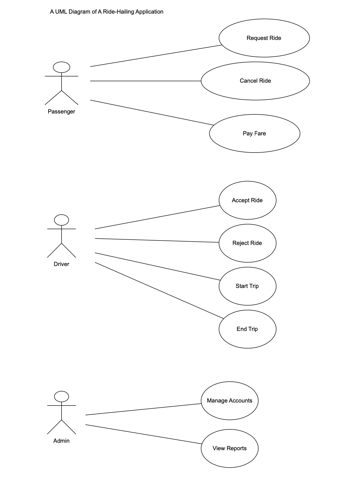

# UML Use Case Diagram for Ride-Hailing Application

## System Description
This UML Use Case Diagram represents a Ride-Hailing Application that connects passengers with drivers, enabling seamless booking, trip management, and fare processing. Additionally, it allows administrators to manage accounts and generate reports to ensure efficient system operations.

---

## Actors and Responsibilities

1. **Passenger**
   - **Request Ride**: Allows passengers to book a ride by specifying their pickup and drop-off locations.
   - **Cancel Ride**: Enables passengers to cancel a booked ride.
   - **Pay Fare**: Facilitates passengers to pay for their completed rides through integrated payment methods.

2. **Driver**
   - **Accept Ride**: Allows drivers to accept ride requests from passengers.
   - **Reject Ride**: Enables drivers to decline a ride request if unavailable or unable to fulfill the request.
   - **Start Trip**: Marks the start of a trip after picking up the passenger.
   - **End Trip**: Marks the trip as completed after reaching the destination.

3. **Admin**
   - **Manage Accounts**: Enables administrators to manage user accounts, including drivers and passengers.
   - **View Reports**: Provides administrators with system reports for monitoring and analysis.

---

## Use Cases

1. **Request Ride**
   - **Actor**: Passenger  
   - **Description**: Passengers can book a ride by entering pickup and destination locations.

2. **Cancel Ride**
   - **Actor**: Passenger  
   - **Description**: Passengers can cancel a booked ride before or during the waiting period.

3. **Pay Fare**
   - **Actor**: Passenger  
   - **Description**: Allows passengers to process payment for a completed trip.

4. **Accept Ride**
   - **Actor**: Driver  
   - **Description**: Drivers can accept a ride request and view trip details.

5. **Reject Ride**
   - **Actor**: Driver  
   - **Description**: Drivers can reject a ride request if they are unavailable.

6. **Start Trip**
   - **Actor**: Driver  
   - **Description**: Marks the beginning of a trip when the driver picks up the passenger.

7. **End Trip**
   - **Actor**: Driver  
   - **Description**: Marks the trip as completed upon reaching the destination.

8. **Manage Accounts**
   - **Actor**: Admin  
   - **Description**: Administrators can create, edit, or deactivate user accounts for both drivers and passengers.

9. **View Reports**
   - **Actor**: Admin  
   - **Description**: Provides administrators with access to system reports for performance monitoring and decision-making.

---

## UML Diagram

You can view the UML Use Case Diagram below or access the full-resolution file in the `/diagram` folder as `diagram.png`.

---

## Notes
- This diagram provides a clear representation of the interactions between the actors (Passenger, Driver, Admin) and the system.
- Ensure all actors' responsibilities and interactions are updated if the system evolves.
